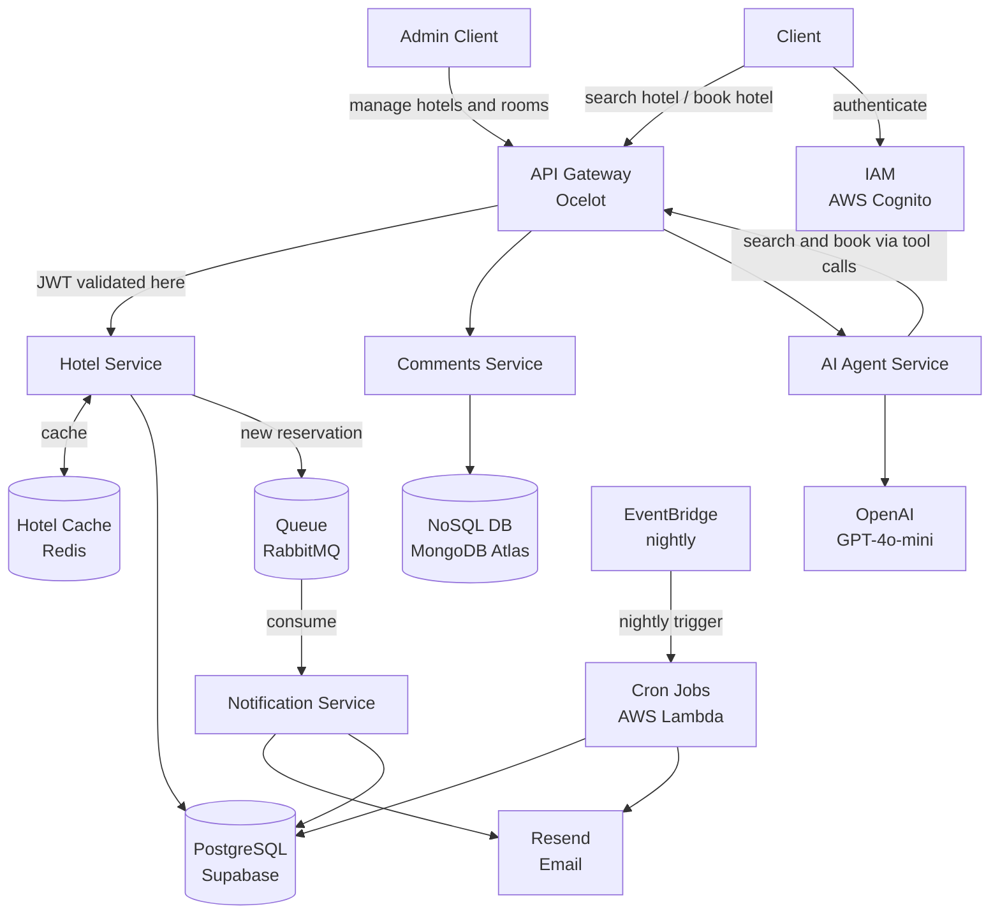
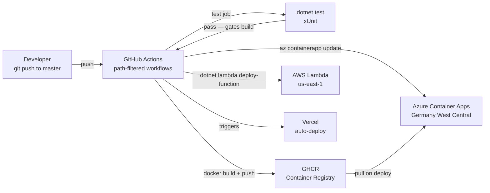
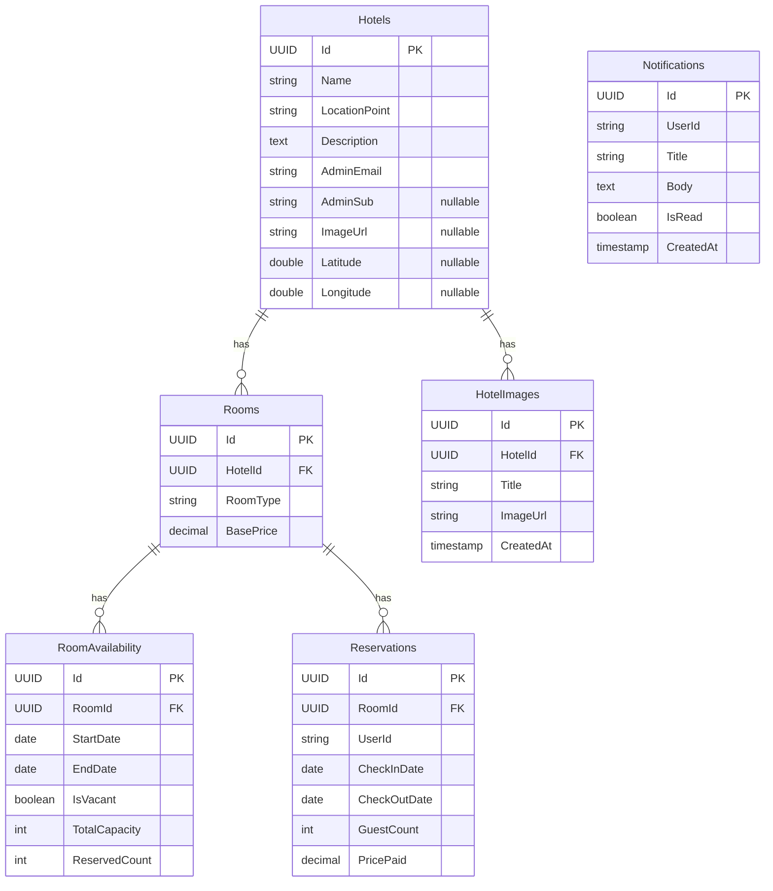
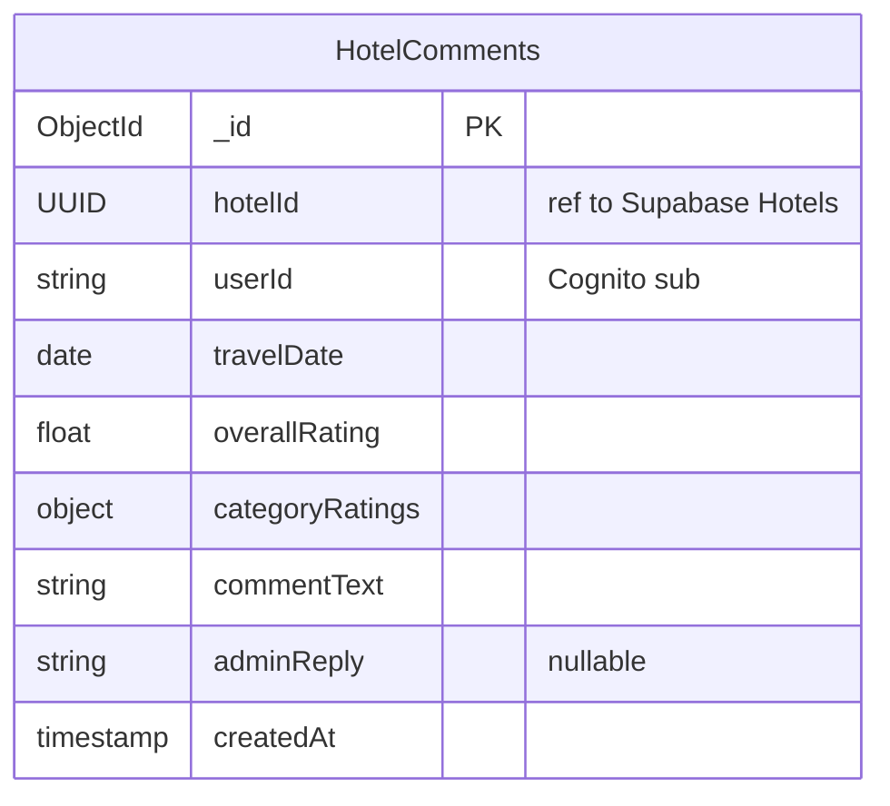

# StayEase - Microservices Hotel Booking System


---

## Overview

StayEase is a Hotels.com-style hotel booking platform developed as a final project for **SE 4458 — Software Architecture & Design of Modern Large Scale Systems**.

The system is built on a microservices architecture with eight independently deployed services. All traffic enters through an Ocelot API Gateway which handles JWT validation via AWS Cognito before routing to downstream services. Hotel search, booking, comments, AI-assisted booking, and real-time notifications are each handled by a dedicated service. Relational data lives in Supabase (PostgreSQL), comments in MongoDB Atlas, and cache in Upstash Redis. An asynchronous booking notification pipeline runs over CloudAMQP RabbitMQ. A nightly AWS Lambda job monitors room capacity and alerts hotel administrators when occupancy exceeds 80% for the following month.

---

## Contents

- [Live URLs](#live-urls)
- [Architecture Overview](#architecture-overview)
- [Deployment](#deployment)
- [Services](#services)
- [Data Models](#data-models)
- [Assumptions](#assumptions)
- [Issues Encountered](#issues-encountered)
- [Local Development](#local-development)
- [Repository Structure](#repository-structure)

---

## Live URLs

> **Note:** The live deployment has been taken down. The services are no longer running.

---

## Architecture Overview

The system follows a microservices architecture. All client requests are routed through a central API Gateway (Ocelot) where JWT tokens are validated. Downstream services communicate synchronously via REST and asynchronously via RabbitMQ.

> Full diagram: [docs/diagrams/microservices.md](docs/diagrams/microservices.md)



---

## Deployment

> **Note:** The deployment has been taken down. The information below reflects the architecture as it was built and deployed.

> Full CI/CD and deployment diagram: [docs/diagrams/deploy_overall.md](docs/diagrams/deploy_overall.md)

| Service | Platform |
|---|---|
| client | Vercel |
| admin-client | Vercel |
| api-gateway | Azure Container Apps (external ingress) |
| hotel-service | Azure Container Apps (internal) |
| comments-service | Azure Container Apps (internal) |
| notification-service | Azure Container Apps (internal) |
| ai-agent-service | Azure Container Apps (internal) |
| cron-jobs | AWS Lambda + EventBridge |

CI/CD is handled by GitHub Actions with path-filtered workflows — a change to one service only redeploys that service. The `test` job (xUnit) gates the build step on every push to `master`.



---

## Services

> Full service relationship diagram: [docs/diagrams/microservices.md](docs/diagrams/microservices.md)

| Service | Responsibility |
|---|---|
| `api-gateway` | Ocelot reverse proxy — JWT validation, rate limiting, single entry point for all traffic |
| `hotel-service` | Hotel and room admin CRUD, search with Redis cache and 15% member discount, booking engine (SELECT FOR UPDATE), in-app notifications |
| `comments-service` | Hotel ratings and comments stored exclusively in MongoDB Atlas |
| `notification-service` | RabbitMQ consumer — sends booking confirmation emails via Resend and writes in-app notification rows |
| `ai-agent-service` | GPT-4o-mini orchestration with tool calling to hotel-service Search and Book APIs |
| `cron-jobs` | AWS Lambda triggered nightly by EventBridge — checks room capacity below 20% for next month and alerts hotel admins |
| `client` | User-facing Next.js app — search, book, AI chat, comments, notifications, My Bookings |
| `admin-client` | Admin Next.js panel — hotel and room management, availability windows, image gallery, reservations, notifications |

---

## Data Models

> Full schema with all fields and assumptions: [docs/4_Data_Models.md](docs/4_Data_Models.md)

### PostgreSQL (Supabase)



### MongoDB Atlas (comments-service only)



`categoryRatings` is an embedded object with fields: `cleanliness`, `staff`, `facilities`, `ecoFriendly`.

---

## Assumptions

> Full assumptions: [docs/5_Assumptions.md](docs/5_Assumptions.md)

- `LocationPoint` is a plain text field used for keyword search (`LIKE '%Istanbul%'`). It is not parsed as coordinates. `Latitude` and `Longitude` are separate nullable columns used only for map pins.
- The 15% member discount is applied server-side whenever a valid Cognito JWT is present on the search request.
- `SELECT FOR UPDATE` on the `RoomAvailability` row is the sole concurrency guard for booking. There is no payment gateway — bookings are confirmed immediately on commit.
- `PricePaid` is captured at booking time and is independent of future `BasePrice` changes.
- The Cognito `sub` claim is used as the canonical user identifier across all services.
- JWT validation happens exclusively at the Ocelot API Gateway. Downstream services trust forwarded headers.
- Any authenticated user can post a comment. There is no verified-guest restriction.
- The nightly Lambda job checks capacity for the next calendar month. Alert threshold is less than 20% remaining capacity.
- The AI agent is stateless — no chat history is persisted between sessions.
- There is no booking cancellation flow.

---

## Issues Encountered

> Full issue log: [docs/6_Issues_Encountered.md](docs/6_Issues_Encountered.md)

- AWS Lambda does not support .NET 9 — upgraded `cron-jobs` to `net10.0`.
- .NET JWT middleware remaps the `sub` claim by default — fixed with `MapInboundClaims = false` on `AddJwtBearer`.
- Frontend was sending the access token instead of the ID token — the access token does not carry the `email` claim, causing downstream rejections.
- Queue name mismatch between publisher (`booking-events`) and consumer (`booking.events`) silently dropped all booking notifications.
- RabbitMQ consumer crashed on email failure and requeued messages indefinitely — isolated the email call in a try-catch so the message is always acknowledged.
- Supabase direct connection requires IPv6 — switched to the session pooler URL for IPv4 compatibility.
- Upstash Redis removed its free tier mid-project — migrated to Redis Cloud with a connection string format change.
- Initial deployment target was Google Cloud Run — switched to Azure Container Apps for better internal service networking.

---

## Local Development

**Prerequisites:** Docker, .NET 9 SDK, Node.js 22

```bash
# Start local infrastructure (Postgres, MongoDB, Redis, RabbitMQ)
docker-compose up

# Run a .NET service
cd src/hotel-service
dotnet run

# Run the user client
cd src/client
npm install && npm run dev

# Run the admin client
cd src/admin-client
npm install && npm run dev -- --port 3001

# Run tests
cd src/hotel-service-tests
dotnet test
```

Each service reads configuration from `appsettings.Development.json` (gitignored). Copy `.env.example` to `.env` and fill in credentials before running `docker-compose up`.

---

## Repository Structure

```
/src
  /api-gateway                  .NET 9 Ocelot reverse proxy
  /hotel-service                .NET 9 Web API — Admin, Search, Booking
  /hotel-service-tests          xUnit tests
  /comments-service             .NET 9 Web API — MongoDB only
  /comments-service-tests       xUnit tests
  /notification-service         .NET 9 Web API — RabbitMQ consumer + Resend email
  /notification-service-tests   xUnit tests
  /ai-agent-service             .NET 9 Web API — OpenAI GPT-4o-mini orchestration
  /ai-agent-service-tests       xUnit tests
  /cron-jobs                    AWS Lambda (.NET 10) — nightly capacity checker
  /client                       Next.js — user app
  /admin-client                 Next.js — admin panel
/.github/workflows              Per-service CI/CD with path filtering
/docs                           Architecture, data models, assumptions, issues
```

---

## License

[MIT](LICENSE)
