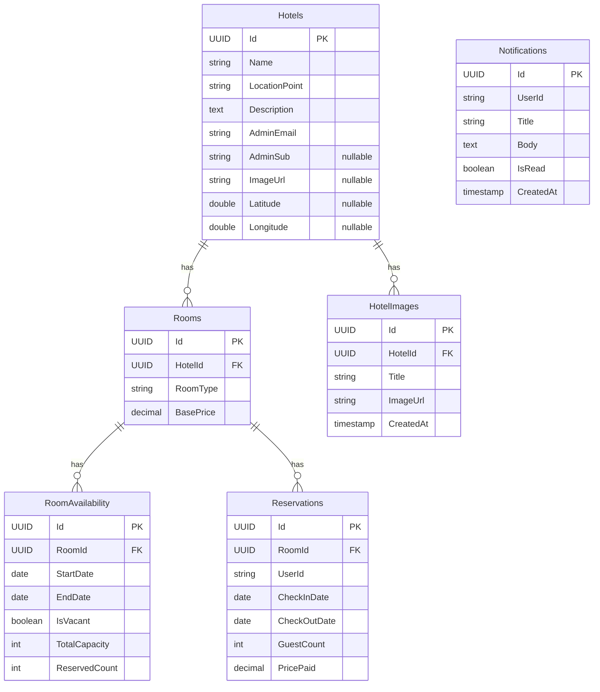
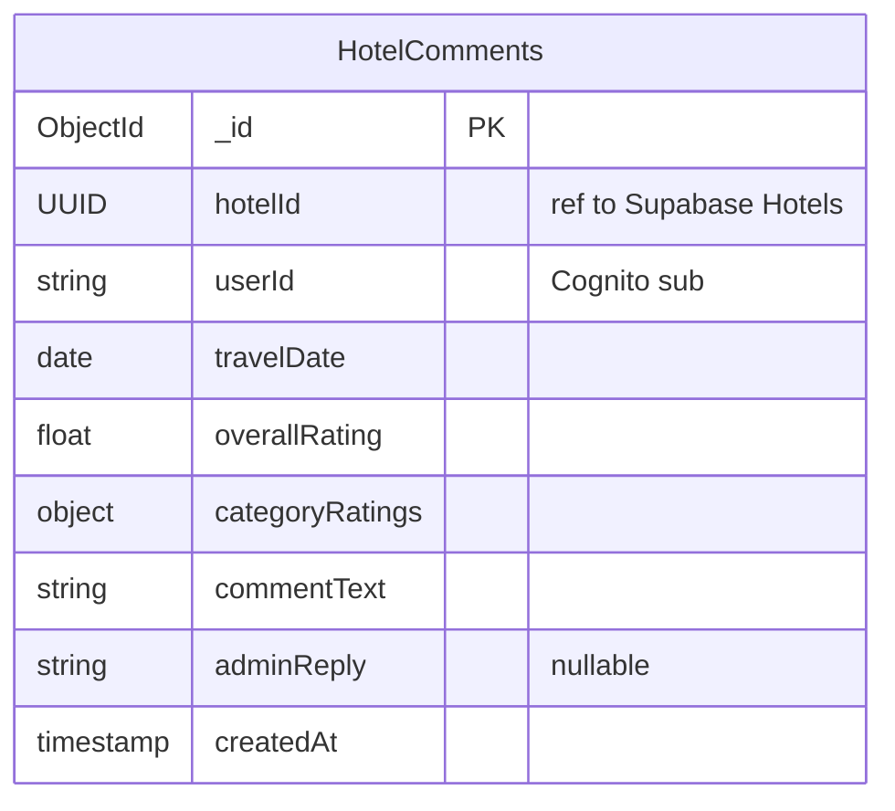

# Data Models and Schemas

## ER Diagrams

### PostgreSQL (Supabase)



### MongoDB Atlas (comments-service only)



> `categoryRatings` is an embedded object with fields: `cleanliness`, `staff`, `facilities`, `ecoFriendly` (all float).

---

## 1. Core Relational Database (Supabase / PostgreSQL)

**Table: Hotels**
- `Id` (UUID, Primary Key)
- `Name` (String)
- `LocationPoint` (String — human-readable location name, e.g. "Istanbul, Turkey"; used for text search)
- `Description` (Text)
- `AdminEmail` (String — email of the creating admin)
- `AdminSub` (String, nullable — Cognito `sub` of the creating admin; used by Lambda to route capacity alerts)
- `ImageUrl` (String, nullable — primary cover image URL)
- `Latitude` (Double, nullable — decimal degrees, used for map pins)
- `Longitude` (Double, nullable — decimal degrees, used for map pins)

**Table: HotelImages**
- `Id` (UUID, Primary Key)
- `HotelId` (UUID, Foreign Key → Hotels)
- `Title` (String)
- `ImageUrl` (String — Supabase Storage public URL)
- `CreatedAt` (Timestamp)

**Table: Rooms**
- `Id` (UUID, Primary Key)
- `HotelId` (UUID, Foreign Key → Hotels)
- `RoomType` (String — e.g., Standard, Family)
- `BasePrice` (Decimal)

**Table: RoomAvailability**
- `Id` (UUID, Primary Key)
- `RoomId` (UUID, Foreign Key → Rooms)
- `StartDate` (Date)
- `EndDate` (Date)
- `IsVacant` (Boolean)
  - Set by admin manually OR automatically set to `false` by booking engine when `ReservedCount >= TotalCapacity`
- `TotalCapacity` (Int — max number of guests this room can accept)
- `ReservedCount` (Int — incremented atomically via SELECT FOR UPDATE on each booking)

**Table: Reservations**
- `Id` (UUID, Primary Key)
- `RoomId` (UUID, Foreign Key → Rooms)
- `UserId` (String — Cognito `sub` claim)
- `CheckInDate` (Date)
- `CheckOutDate` (Date)
- `GuestCount` (Int — number of guests at time of booking)
- `PricePaid` (Decimal — final price after discount, captured at booking time)

**Table: Notifications**
- `Id` (UUID, Primary Key)
- `UserId` (String — Cognito `sub` claim)
- `Title` (String)
- `Body` (Text)
- `IsRead` (Boolean, default false)
- `CreatedAt` (Timestamp)

## 2. NoSQL Database (MongoDB Atlas)
Strictly used by `comments-service` only.

**Collection: HotelComments**
```json
{
  "_id": "ObjectId",
  "hotelId": "UUID (Reference to Supabase Hotels table)",
  "userId": "String (AWS Cognito sub claim)",
  "travelDate": "ISODate",
  "overallRating": 8.0,
  "categoryRatings": {
    "cleanliness": 9.6,
    "staff": 9.6,
    "facilities": 9.4,
    "ecoFriendly": 9.4
  },
  "commentText": "Great experience...",
  "adminReply": "Thank you for your feedback.",
  "createdAt": "ISODate"
}
```

## 3. Assumptions Documented
- `LocationPoint` is a plain text field used for keyword search (`LIKE '%Istanbul%'`). It is NOT parsed as coordinates.
- `Latitude` / `Longitude` are separate nullable double columns used exclusively for map pin rendering (react-leaflet). Hotels without coords are silently skipped on the map. Admin sets these via a Leaflet map picker in the admin panel.
- `SearchResultItem` DTO exposes both `Latitude` and `Longitude` so the user client map gets coords without an extra API call.
- `PricePaid` is stored on `Reservations` to preserve the price at booking time, independent of any future `BasePrice` changes.
- `GuestCount` is stored on `Reservations` to reconstruct what was booked (users search by number of guests).
- Comments can be posted by any authenticated user (not restricted to verified guests). Documented as an assumption.
