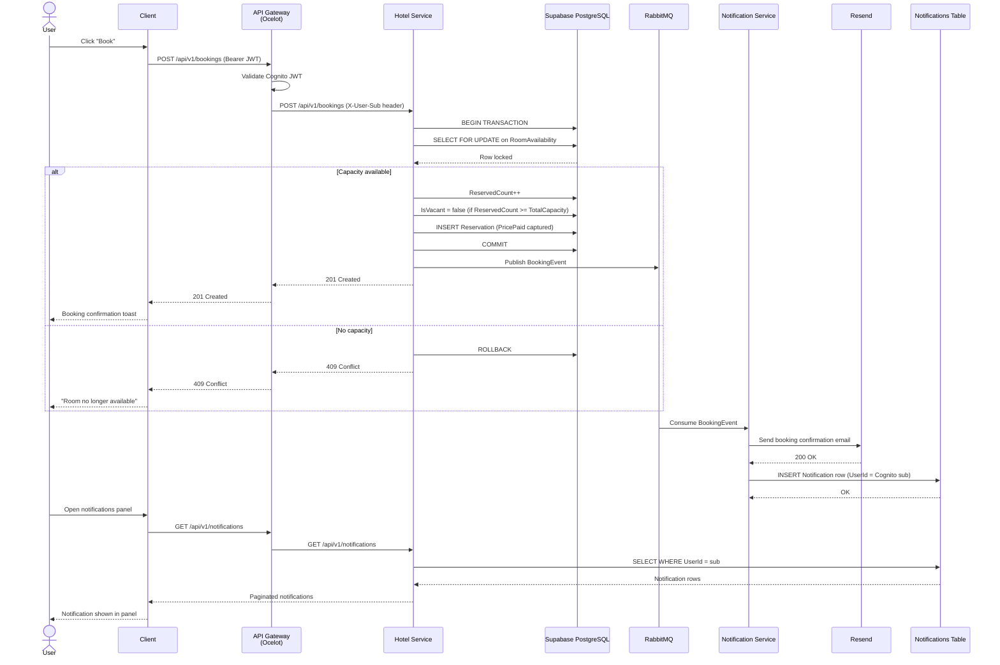
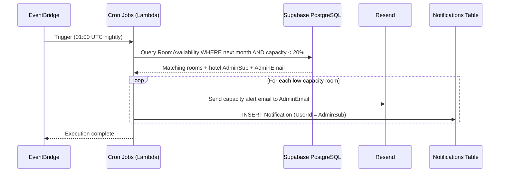

# Booking & Notification Flow

End-to-end sequence from a user booking a room to receiving a confirmation email and in-app notification.

```mermaid
sequenceDiagram
    actor User
    participant Client
    participant Gateway as API Gateway<br/>(Ocelot)
    participant HotelSvc as Hotel Service
    participant DB as Supabase PostgreSQL
    participant Queue as RabbitMQ
    participant NotifSvc as Notification Service
    participant Resend
    participant NotifDB as Notifications Table

    User->>Client: Click "Book"
    Client->>Gateway: POST /api/v1/bookings (Bearer JWT)
    Gateway->>Gateway: Validate Cognito JWT
    Gateway->>HotelSvc: POST /api/v1/bookings (X-User-Sub header)

    HotelSvc->>DB: BEGIN TRANSACTION
    HotelSvc->>DB: SELECT FOR UPDATE on RoomAvailability
    DB-->>HotelSvc: Row locked

    alt Capacity available
        HotelSvc->>DB: ReservedCount++
        HotelSvc->>DB: IsVacant = false (if ReservedCount >= TotalCapacity)
        HotelSvc->>DB: INSERT Reservation (PricePaid captured)
        HotelSvc->>DB: COMMIT
        HotelSvc->>Queue: Publish BookingEvent
        HotelSvc-->>Gateway: 201 Created
        Gateway-->>Client: 201 Created
        Client-->>User: Booking confirmation toast
    else No capacity
        HotelSvc->>DB: ROLLBACK
        HotelSvc-->>Gateway: 409 Conflict
        Gateway-->>Client: 409 Conflict
        Client-->>User: "Room no longer available"
    end

    Queue->>NotifSvc: Consume BookingEvent
    NotifSvc->>Resend: Send booking confirmation email
    Resend-->>NotifSvc: 200 OK
    NotifSvc->>NotifDB: INSERT Notification row (UserId = Cognito sub)
    NotifDB-->>NotifSvc: OK

    User->>Client: Open notifications panel
    Client->>Gateway: GET /api/v1/notifications
    Gateway->>HotelSvc: GET /api/v1/notifications
    HotelSvc->>NotifDB: SELECT WHERE UserId = sub
    NotifDB-->>HotelSvc: Notification rows
    HotelSvc-->>Client: Paginated notifications
    Client-->>User: Notification shown in panel
```

## Nightly Capacity Alert Flow

```mermaid
sequenceDiagram
    participant EventBridge
    participant Lambda as Cron Jobs (Lambda)
    participant DB as Supabase PostgreSQL
    participant Resend
    participant NotifDB as Notifications Table

    EventBridge->>Lambda: Trigger (01:00 UTC nightly)
    Lambda->>DB: Query RoomAvailability WHERE next month AND capacity < 20%
    DB-->>Lambda: Matching rooms + hotel AdminSub + AdminEmail

    loop For each low-capacity room
        Lambda->>Resend: Send capacity alert email to AdminEmail
        Lambda->>NotifDB: INSERT Notification (UserId = AdminSub)
    end

    Lambda-->>EventBridge: Execution complete
```
