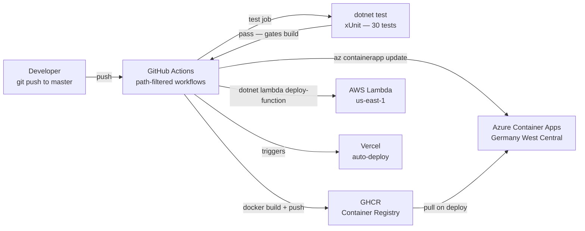
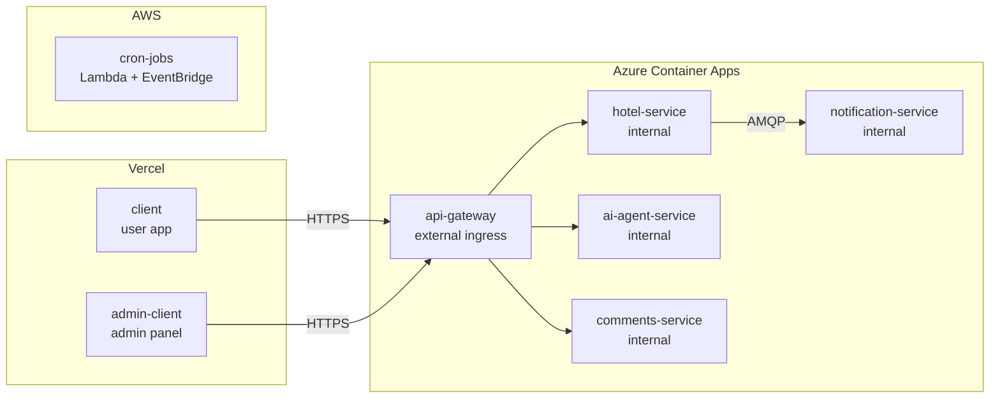

# Deployment & CI/CD

How code gets from a commit to production, and where each service runs.

## CI/CD Pipeline

Each service has its own GitHub Actions workflow triggered by path filtering. A change to `src/hotel-service/**` only redeploys `hotel-service`.

## Deployment Targets

### Service Dependencies

| Service | Platform | Dependencies |
|---|---|---|
| client | Vercel | api-gateway |
| admin-client | Vercel | api-gateway |
| api-gateway | Azure Container Apps | AWS Cognito (JWT), internal services |
| hotel-service | Azure Container Apps | Supabase PostgreSQL, Upstash Redis, CloudAMQP RabbitMQ |
| notification-service | Azure Container Apps | CloudAMQP RabbitMQ, Resend, Supabase PostgreSQL |
| comments-service | Azure Container Apps | MongoDB Atlas |
| ai-agent-service | Azure Container Apps | OpenAI API, hotel-service |
| cron-jobs | AWS Lambda + EventBridge | Supabase PostgreSQL, Resend |

## Secrets Management

| Layer | Mechanism |
|---|---|
| .NET services on ACA | ACA secret store → injected as env vars via `secretref:` |
| GitHub Actions → Azure | OIDC federated identity — no stored credentials |
| GitHub Actions → AWS | IAM access key stored as GitHub secret |
| Frontends | Vercel environment variables (public config only) |
| Local dev | `.env` at repo root (gitignored) |
