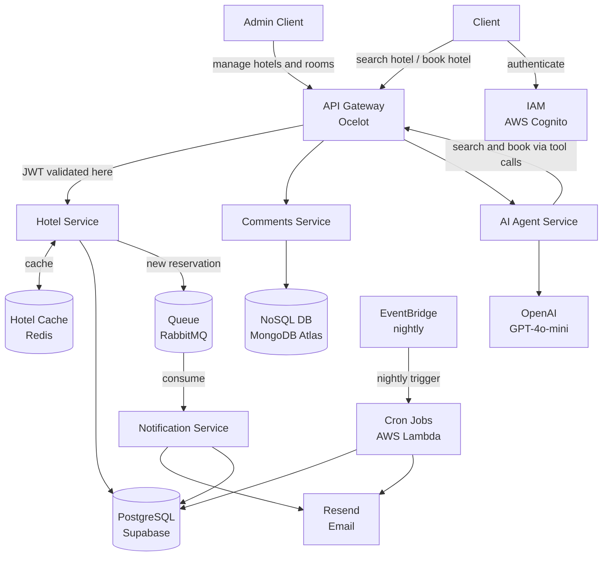

# Microservices Architecture

Relationships between all services, data stores, and external systems.

```mermaid
graph TD
    AdminClient[Admin Client]
    Client[Client]
    IAM[IAM<br>AWS Cognito]
    Gateway[API Gateway<br>Ocelot]
    HotelSvc[Hotel Service]
    CommentsSvc[Comments Service]
    AiAgent[AI Agent Service]
    NotifSvc[Notification Service]
    Lambda[Cron Jobs<br>AWS Lambda]

    Redis[(Hotel Cache<br>Redis)]
    Queue[(Queue<br>RabbitMQ)]
    PgDB[(PostgreSQL<br>Supabase)]
    MongoDB[(NoSQL DB<br>MongoDB Atlas)]
    Resend[Resend<br>Email]
    OpenAI[OpenAI<br>GPT-4o-mini]
    EventBridge[EventBridge<br>nightly]

    AdminClient -->|manage hotels and rooms| Gateway
    Client -->|search hotel / book hotel| Gateway
    Client -->|authenticate| IAM
    AiAgent -->|search and book via tool calls| Gateway

    Gateway -->|JWT validated here| HotelSvc
    Gateway --> CommentsSvc
    Gateway --> AiAgent

    HotelSvc <-->|cache| Redis
    HotelSvc --> PgDB
    HotelSvc -->|new reservation| Queue

    CommentsSvc --> MongoDB

    Queue -->|consume| NotifSvc
    NotifSvc --> Resend
    NotifSvc --> PgDB

    AiAgent --> OpenAI

    EventBridge -->|nightly trigger| Lambda
    Lambda --> PgDB
    Lambda --> Resend
```
